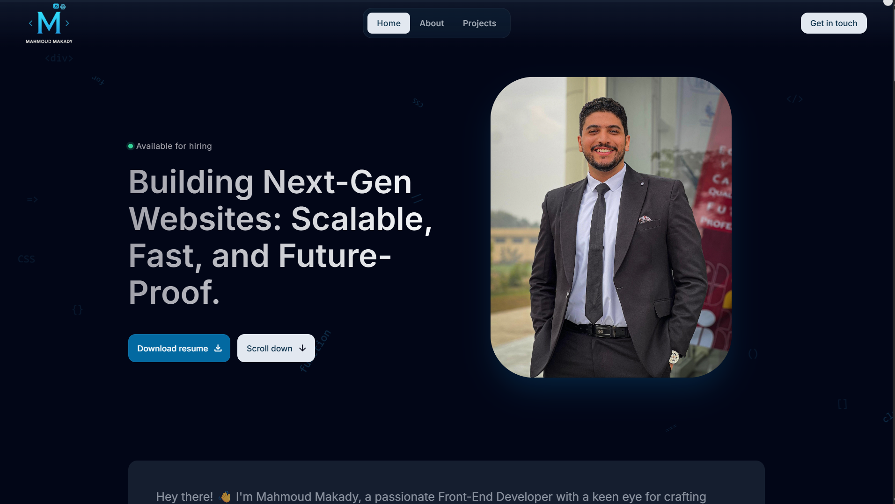

🌐 Mahmoud Makady | Portfolio Website

Welcome to my personal portfolio website built with React, Tailwind CSS, and Vite.  
This project showcases my web development projects, skills, and background in a modern, responsive design.

🚀 Live Demo

Check out the live website here:  
🔗 [https://mahmoud-makady.is-a.dev](https://mahmoud-makady.is-a.dev)

📸 Preview

🛠️ Tech Stack

- ⚛️ React – Front-end JavaScript library
- ⚡ Vite – Lightning-fast build tool
- 🎨 Tailwind CSS – Utility-first CSS framework
- 🔤 TypeScript (optional, if used)
- 🌐 Netlify – Hosting and deployment

🧑‍💻 How to Run Locally

1- Clone the repo:
  - git clone https://github.com/Mahmoud-Makady/My-Portfolio.git
  - cd My-Portfolio
2- Install dependencies:
  - npm install
3- Run the development server:
  - npm run dev

📁 Folder Structure

My-Portfolio/
├── public/            # Static files (images, preview, etc.)
├── src/
│   ├── assets/        # Images and static assets
│   ├── components/    # Reusable React components
│   ├── pages/         # Portfolio sections (Home, Projects, Contact...)
│   ├── App.jsx        # Main App component
│   └── main.jsx       # Entry point
├── index.html
├── tailwind.config.js
├── vite.config.js
└── README.md
